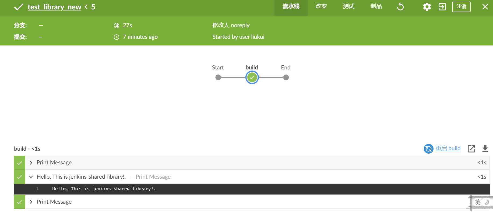

# jenkins-shared-library
Jenkins 创建和使用共享库的介绍


```
@Library('global-shared-library@master') _
pipeline {
    agent{ 
        node{
          label 'jenkins-slave'
		}
    }
    
    environment {
       _version = createVersion()
    }
    
    stages {
        stage ('build') {
            steps {
                script {
                    def util = new com.giant.pipeline.Utils()
                    def version = util.createVersion("${BUILD_NUMBER}")
                    echo "${version}"
                    sayHello 'This is jenkins-shared-library!'
                    echo "${_version}"
                }
            }
        }
    }
}

def createVersion() {
    return new Date().format('yyyyMM') + "-${env.BUILD_NUMBER}"
}
```
执行结果：


